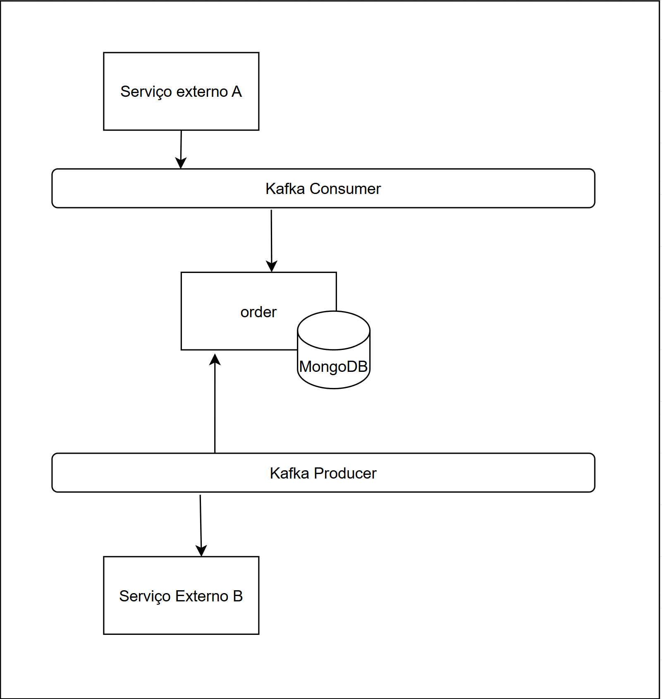

# Order - Microservice

## 📌 Tecnologias Utilizadas

Este projeto utiliza as seguintes tecnologias e ferramentas:

- **Java** - Linguagem principal do projeto
- **Spring Boot** - Framework para facilitar o desenvolvimento
- **Maven** - Gerenciador de dependências
- **MongoDB** - Banco de dados NoSQL utilizado para persistência
- **Redis** - Banco de dados em memória para cache
- **Kafka** - Sistema de mensageria para comunicação assíncrona
- **Docker** - Ferramenta de conteinerização para facilitar a execução


## 🚀 Como Executar o Projeto

Para rodar o projeto localmente, siga os passos abaixo:

1. **Clone o repositório**
   ```sh
   git clone https://github.com/wolwerr/order.git
   cd order
   ```

2. **Suba os containers usando Docker Compose**
   ```sh
   docker-compose up -d
   ```

Isso irá iniciar os seguintes serviços:

- Aplicação Spring Boot rodando na porta `8080`
- Banco de dados **MongoDB**
- Interface gráfica para MongoDB (**Mongo Express**)
- Servidor **Kafka** para mensageria
- **Zookeeper**, necessário para o Kafka funcionar corretamente

3. **Acesse a documentação da API (Swagger UI)**  
   Após subir os containers, você pode acessar a documentação interativa da API em:  
   👉 [Swagger UI](http://localhost:8080/swagger-ui.html)

## 🏗 Arquitetura do Sistema

A estrutura do projeto segue uma arquitetura baseada em microsserviços, utilizando Kafka para comunicação assíncrona entre os serviços.



---

Caso tenha alguma dúvida, sinta-se à vontade para contribuir ou abrir uma issue! 🚀